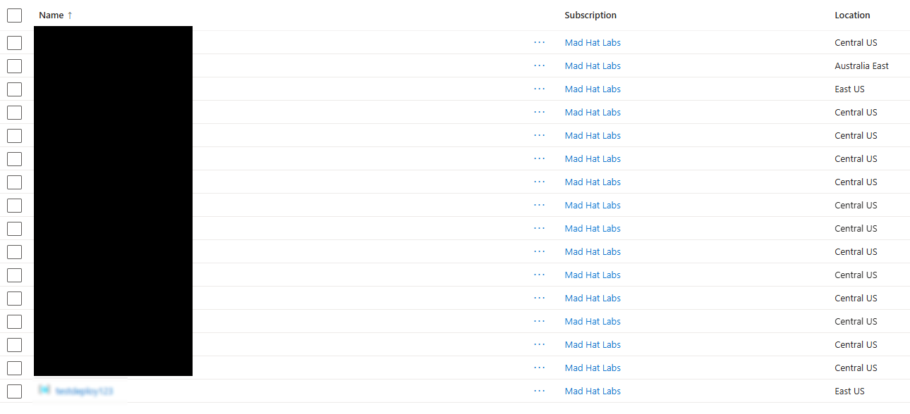
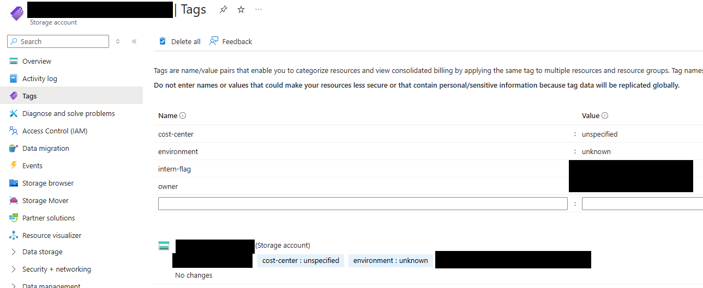
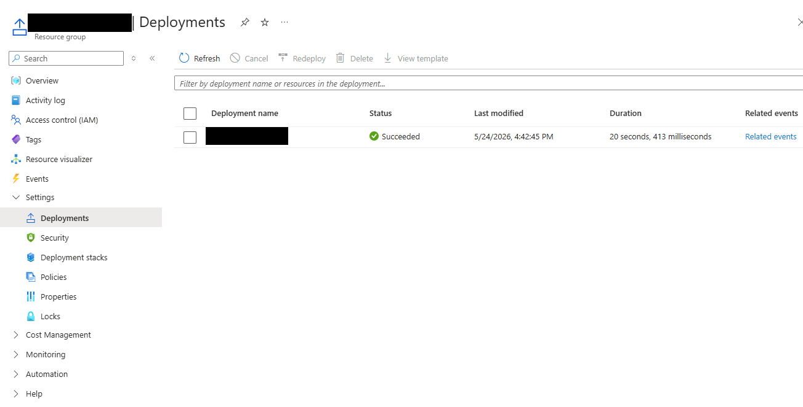
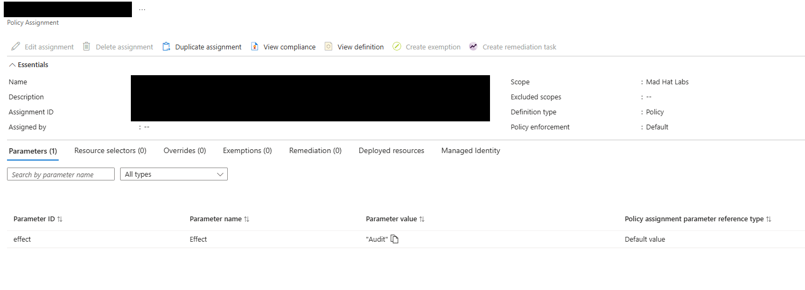

# Operation Dead Deploy

*Investigating a resource group failing governance standards*

## Scenario

A junior intern was given temporary Contributor access to spin up a test environment. The intern was not familiar with the company's governance standards and deployed non-compliant resources. I needed to review resource groups and resources, identify what governance failed, and document the evidence. I had Reader access to everything the intern touched.

## Environment

Live multi-user Azure training tenant, Reader access.

## Investigation

### Stage 1 — Identify the non-compliant resource group

I reviewed all the resource groups within the subscription and identified one that didn't follow the company / Microsoft naming conventions. Because this resource group didn't match the naming standards, it was flagged as an anomaly and needed to be investigated further.

### Stage 2 — Inspect the payload

I clicked into the resource group and found one deployed resource: a storage account. I opened the tags to see what information I could gather about who created it. Multiple tags had been added, and those tags identified the resource group as having been deployed by a company intern.

### Stage 3 — Trace the deployment

I clicked into the Deployments tab to gather additional information about the resource group and resource. The deployment name also didn't match the required naming conventions.

### Stage 4 — Why weren't naming conventions enforced?

The company has a policy assigned to its resource groups that's supposed to enforce naming conventions, so I had to find out why it wasn't being enforced here. I looked at the group's policy compliance and noticed a related non-compliant policy.

The non-compliant policy was set to **Audit**, which logged the non-compliant resource but still allowed it to be created.

## What stood out to me

Something as simple as compliant naming conventions can be a legitimate mistake on the part of an employee, or an indication of unauthorized access or unauthorized provisioning. Either is serious, because it can result in significant unnecessary expense or a larger data breach.

## Findings and recommendations

This non-compliant resource was the result of a legitimate deployment created without following compliant naming conventions, because the naming policy was not set to enforce them. I recommend determining whether the Audit effect is intentional, and if not, adjusting the policy parameters to enforce the expected policy outcome.

## What I learned

- The larger an Azure environment becomes, the more important it is to enforce consistent policies.
- Tags contain a lot of valuable information about ownership, cost, and lifecycle.
- Every resource has an audit trail in the form of logs. These can be correlated with security alerts to build an incident timeline.
- Make sure the parameters of your policies match the desired policy outcome.
