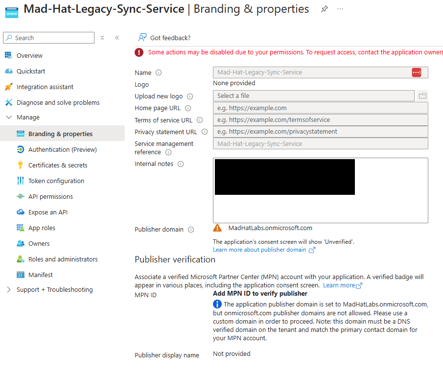
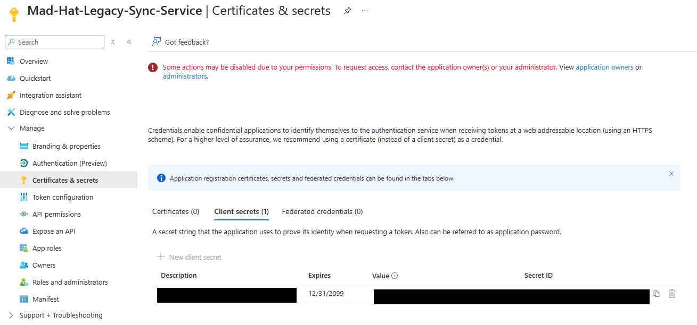
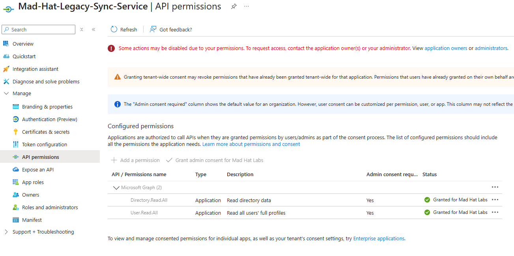
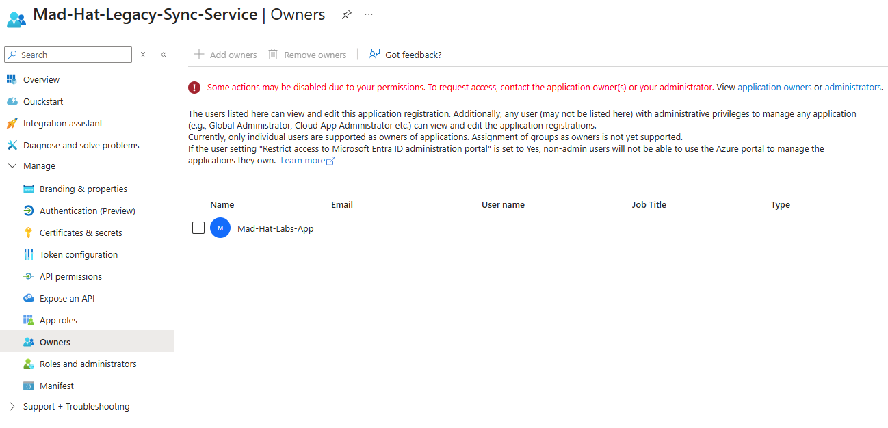
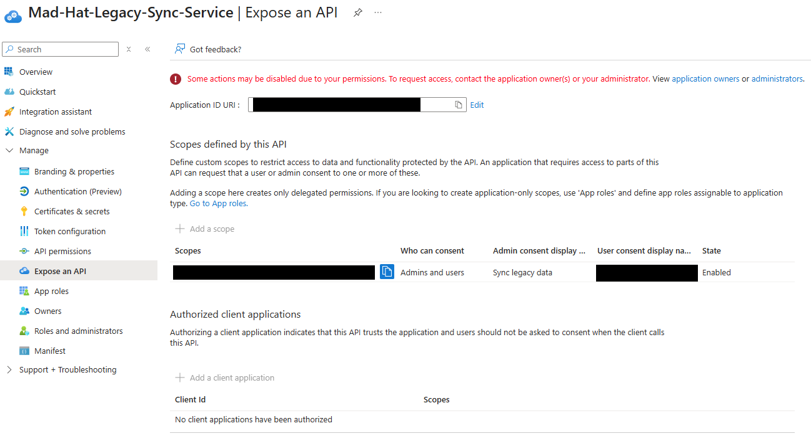
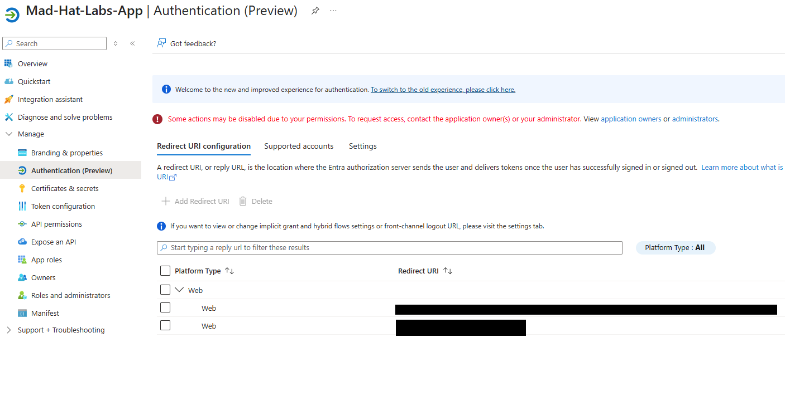

# The Stolen Identity

*Reconstructing an OAuth consent-phishing kill chain across two linked app registrations in Entra ID*

## Scenario

Over the weekend, someone accessed the tenant through the identity plane. There were no exploits, just a series of sign-ins that looked normal, so nothing alarmed. A single legacy internal sync app (an old internal connector, set up years ago) was later flagged as tampered with. Items appeared on it that weren't there before.

My job, coming in with Reader access, was to reconstruct what the attacker did stage by stage using only that one app registration's configuration, and to determine why the standard incident-response playbook would not have evicted them.

## Environment

Live multi-user Azure training tenant, Reader access on directory apps. Microsoft Entra ID (Azure AD). Investigation done in the Azure portal, App registrations (Branding & properties, Certificates & secrets, API permissions, Owners, Expose an API, Authentication blades). CyberChef used for URL decoding.

## Investigation

### Stage 1 — Entry: a stolen post-MFA session token

I started at the legacy app's Branding & properties blade, where the incident team had recorded the entry method as an internal note. The entry wasn't a broken system, it was a stolen identity. A user had been phished through an adversary-in-the-middle (AiTM) reverse proxy. Because the user's MFA method wasn't phishing-resistant, the proxy was able to relay the entire exchange, password and MFA, and capture the session token Microsoft issued afterward.

The second half of the entry was a least-privilege failure. Through years of access drift, the phished user had been left as an Owner of this legacy app. That leftover ownership is what made the rest of the chain possible.

### Stage 2 — Escalate: an attacker-minted client secret

I opened Certificates & secrets → Client secrets. There was one secret, and the tell was in the Expires column, which was dated nearly a century out.

A phished user only has that user's access, and this user was low-privilege. Operating as them would be capped at their ceiling. So, the attacker used the leftover Owner rights to write a new credential onto the app. That secret let them authenticate as the app itself through the OAuth client credentials flow.

Authenticating as the app meant inheriting the app's application permissions, which have no user ceiling. That's what makes it an escalation and not lateral movement. The user's limited access stops being the ceiling entirely.

The ~99-year expiry is the persistence signal. A normal secret expires in months to force rotation; a century-long one defeats rotation completely. On a flagged app during an active incident, that reads as a deliberate persistence mechanism.

### Stage 3 — Pivot: an ownership backdoor, and the blast radius

Two blades mattered here.

API permissions: The permissions were application type (acting as the app, no user needed), granted with admin consent (already approved), on Microsoft Graph. Application-type, admin-consented, on Graph, the API that fronts mail, files, users, and directory, which means the app's reach was effectively tenant-wide. That combination is the blast radius; it's the difference between an annoying foothold and a full tenant compromise.

Owners: A second, attacker-registered app's service principal had been added to the legacy app's Owners list. By making a second app they control a co-owner, the attacker built persistence that survives secret deletion. An owner can simply mint a fresh secret. And it's camouflaged: unlike the 99-year secret, an ownership entry has no obvious tell, and it hides in the Owners blade, a place defenders rarely think to audit. Fully evicting the attacker means noticing and removing that rogue owner.

### Stage 4 — Persist: a consent-based backdoor via a custom scope

I opened Expose an API on the legacy app and found a custom scope had been defined. This flips the app from being a client into being a resource.

This survives credential rotation, because it's tied to user consent, not credentials.

The Expose an API blade only defines the scope. No durable access exists yet at this point. The persisting artifact, an OAuth grant / refresh token, is only created later, when a user is tricked into consenting.

This is a documented technique called consent phishing / illicit consent grant (MITRE ATT&CK T1528).

### Stage 5 — Loot: the consent-phishing URL and the confused deputy

Finally, I checked the rogue app's Authentication blade and found its redirect URIs. One looked like an ordinary local-development URL (likely a decoy). The other pointed at attacker-controlled infrastructure. Combined with the rogue app's client ID and the exposed API scope, that redirect URI assembles a working consent-phishing URL.

Why this path exists at all instead of just re-phishing credentials: by this point in a real incident the org has hardened Conditional Access, so stolen credentials get blocked due to wrong device, strange IP, MFA prompt. Consent phishing sidesteps all of it, because there is no login event for Conditional Access to evaluate. The victim is already signed in on their corporate machine, already past MFA, already on a compliant device. The link doesn't ask them to log in; it asks them to consent. The attacker piggybacks on the user's existing, fully compliant session and harvests the consent output.

Mechanically: the user clicks Accept on a real Microsoft consent prompt → Entra returns an authorization code to the trap redirect → the rogue app's backend swaps that code for a token (the OAuth **authorization code flow**) → the attacker holds a delegated token acting as that user.

The confused deputy: This is the concept the whole finale turns on. That harvested token is only a delegated token for the custom scope. It doesn't carry the legacy app's powerful application permissions. But the scope lets the attacker trigger the legacy app's backend, and when the legacy app runs that job it uses its own privileged Graph permissions to do the work.

It can't tell a malicious request from a legitimate one, because a valid token for its scope is the only thing it checks. So, the attacker never holds the privileged permissions. They get the trusted app that holds them to act on their behalf.

Containment alone fails because the consent creates an OAuth2PermissionGrant. A password reset doesn't remove it. Revoking sign-in sessions doesn't remove it. Enforcing MFA doesn't remove it. It persists until the grant is explicitly revoked.

## What broke / what surprised me

The thing that genuinely caught me was the eviction step. My instinct, when asked how to kick the attacker out, was to delete the rogue app and remove the custom scope. It took me a while to realize that removing the mechanism doesn't remove an already-issued consent grant.

The OAuth2PermissionGrant keeps working until it's explicitly revoked. That's the exact trap the attacker built the whole consent-based path to exploit. Defenders reflexively reach for the credential drawer (reset, rotate, delete) while the persistence sits in the consent drawer, untouched. Feeling that pull myself is the reason I'll remember it.

Two other things surprised me: that any standard user can register an app by default in Entra, and that owning an app registration is effectively an unlogged privilege path. A review of Global Admins might miss it completely.

## Findings and recommendations

- Explicitly revoke the OAuth2PermissionGrant. This is the one that matters most: containment (password reset, session revocation, MFA enforcement) does not remove it.

- Revoke the attacker-minted client secret.

- Remove the rogue service principal from the legacy app's Owners list.

- Delete the custom exposed API scope, and remove the attacker-controlled redirect URI.

- Review and reduce the Graph application permissions. Apply least privilege to the app identity.

- Disable default user app registration at the tenant level.

- Audit every app registration's Owners list the same way directory role membership is audited, and alert on new client secrets and new redirect URIs.

## What I learned

- MFA protects the authentication event, not the token it issues. Phishing-resistant methods (FIDO2 / passkeys) beat AiTM because they're cryptographically bound to the relying party's origin. The authenticator, not the user, checks the domain, so a look-alike site can't get a valid signature.

- Delegated (capped by the signed-in user) versus application (no user ceiling) permissions is the hinge of app-identity escalation, and app identities are more valuable targets than users because they rarely have MFA, often hold broad standing permissions, and almost nobody watches them.

- App registrations are a privilege path that a role review misses entirely. What I'd do differently going forward: audit app owners and app credentials, not just admin role assignments.
